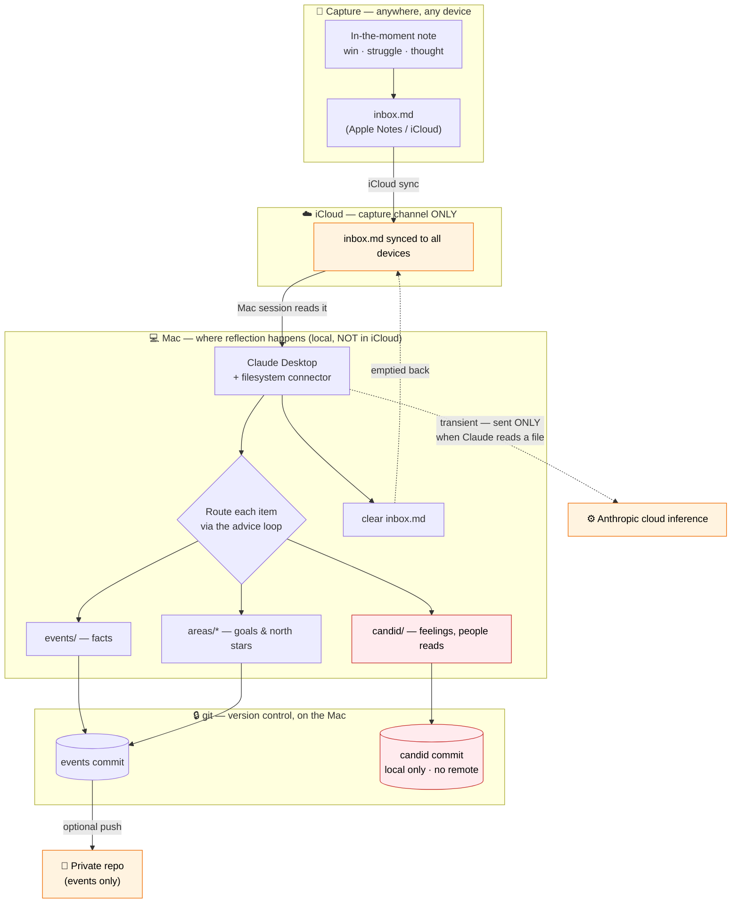

# How a day flows

Capture anywhere on your phone. Reflect on the Mac, where Claude can actually file
things. The `inbox.md` note is the bridge between the two.

## Reading it

1. **Capture (phone):** a thought goes into `inbox.md` via Apple Notes/iCloud. No
   framework, no thinking — just dump it. Facts only; nothing you'd want private.
2. **iCloud carries only the inbox** (orange). Nothing else touches iCloud.
3. **Mac session:** you paste the boot prompt; Claude reads `inbox.md`, runs the
   advice loop, **routes** each item — facts → `events/`, candid → `candid/`, goals →
   `areas/*` — then **empties the inbox**.
4. **git** versions everything locally. `events` can optionally push to a private
   repo; `candid` (red) is committed locally and **never gets a remote or iCloud**.
5. **Anthropic (dotted)** sees content **only transiently, only when Claude reads a
   file** during a session — never a stored copy, and candid only if you bring it
   into that session.

The two red nodes are the privacy floor: candid data lives on exactly one machine you
control. Everything cloud-colored is either facts or a transient processing hop —
explained honestly in [privacy.md](privacy.md).
